# Atalhos
- [Requisitos PIF](https://github.com/renanalencar/pif-2026-1-desc?tab=readme-ov-file#vis%C3%A3o-geral)
- [Entregas FDS](https://drive.google.com/file/d/1QdrB_ex6qDF2VHWUT76D6Q5JakzSM-mX/view)
- [Relatório Evolutivo](https://docs.google.com/document/d/1gqUDhjhyERNt30xJk6r1T10XqWH3UZcp/edit?usp=sharing&ouid=111242244603130521782&rtpof=true&sd=true)

# 🕹️ Jogo de Adivinhação – Decodificação de Frequência: Contra-ataque Hacker

Projeto Integrador 2026.1 – Programação Imperativa e Funcional (PIF)  
**Tema:** Jogo de adivinhação com narrativa de segurança cibernética.

## 📖 Sinopse

Você é um analista de segurança da CyberCore. Um ataque hacker está injetando uma frequência desconhecida (entre 1 e 100 MHz) nos servidores. Para neutralizar a invasão, você deve **descobrir a frequência alvo** com o menor número de tentativas possível. A cada palpite, o sistema informa se a frequência é muito baixa, muito alta ou correta. Cada partida é registrada em um arquivo de histórico, permitindo estatísticas e sugestões de melhoria.

## 👥 Equipe

| Integrante | Papel | Responsabilidades |
|------------|-------|--------------------|
| Breno Luiz de Lima Cruz | Desenvolvedor / Organizador / Documentador | Gerência do time, documentação geral, auxílio no desenvolvimento |
| Miguel Pereira de Lemos | Desenvolvedor / Especialista em C | Implementação da lógica principal, recursão, otimização em C |
| Eloi de Lima Sousa | Desenvolvedor de Front-end | Criação das telas, interface com o usuário (modo texto ou gráfico) |
| Lucas Felipe Barreto Cavalcante | Desenvolvedor de Back-end | Lógica do jogo, validações, persistência em arquivo |
| Lucas Filipe de Lima Segundo | Desenvolvedor de Front-end | Telas, experiência do usuário, fluxo de navegação |
| Leticia Gomes da Silva | Desenvolvedora de Front-end | Telas, componentes visuais, integração com back-end |
| Pablo Arthur Eustáquio de Lima | Desenvolvedor de Back-end | Algoritmos de análise estatística, recursão, manipulação de arquivos |

> **Nota:** Os papéis podem ser rotativos conforme a necessidade das sprints.

## 📦 Entrega 01 – Histórias de usuário, backlog e organização

### Quadro Kanban
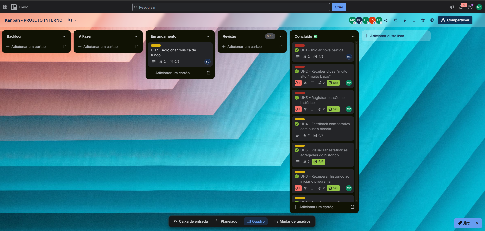

### Backlog priorizado


### Histórias de usuário (detalhadas)
As 10 histórias completas estão disponíveis no [quadro do Trello](https://trello.com/b/MNMd59kf/kanban-projeto-interno) e também no arquivo [`historias.md`](docs/historias.md).

## 🎨 Entrega 02 – Prototipação, UX e Modelagem de Processos

### Protótipos de Baixa Fidelidade (Lo-Fi)
Os protótipos iniciais foram desenvolvidos no Figma para validar o fluxo de navegação e a hierarquia de informações.
- 🔗 [Acesse o protótipo no Figma aqui](https://www.figma.com/make/hvzhHgR8lGsDkOvLYZvtSs/CyberCore-Game-Prototype?t=PWjPK4Py01ldBkYl-20&fullscreen=1)

### Sketches e Storyboards
Abaixo estão os esboços manuais e a sequência narrativa das principais interações (mínimo de 10 unidades).

| História | Sketch / Storyboard |
|----------|---------------------|
| **UH1** | 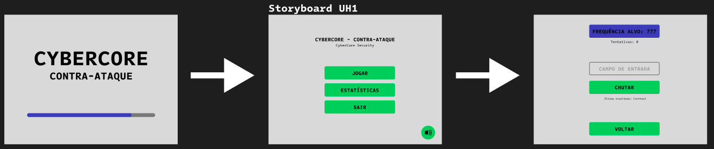 |
| **UH2** | 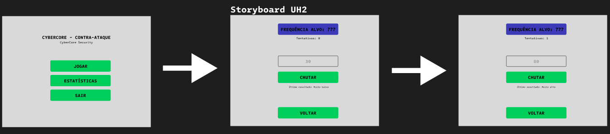 |
| **UH3** | 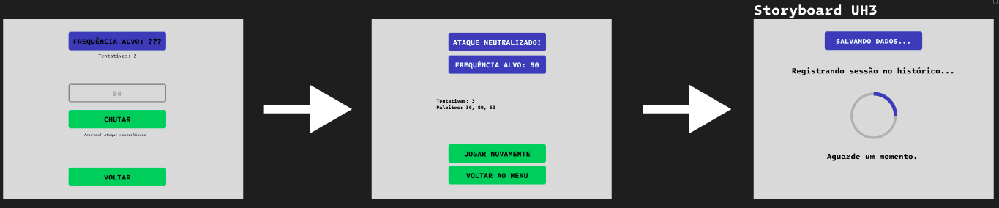 |
| **UH4** | 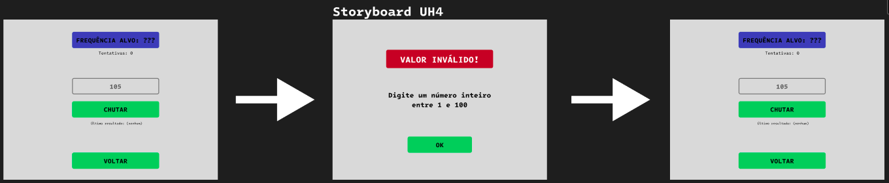 |
| **UH5** | 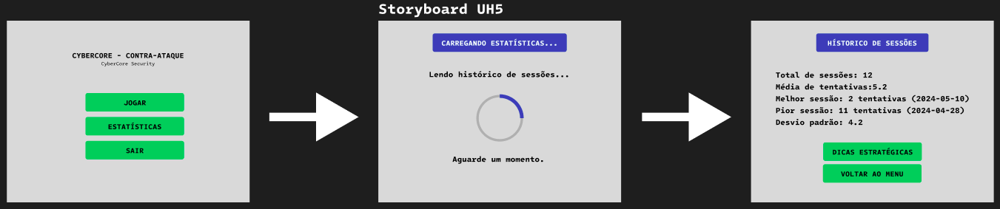 |
| **UH6** | 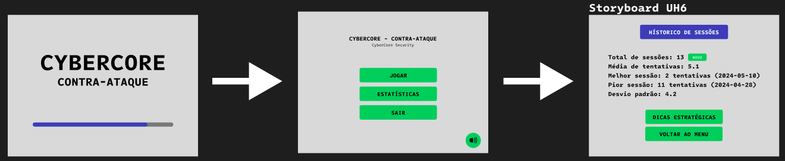 |
| **UH7** | 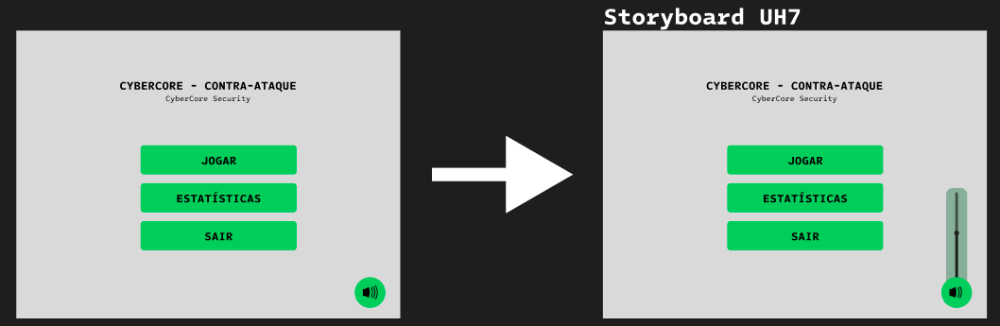 |
| **UH8** | 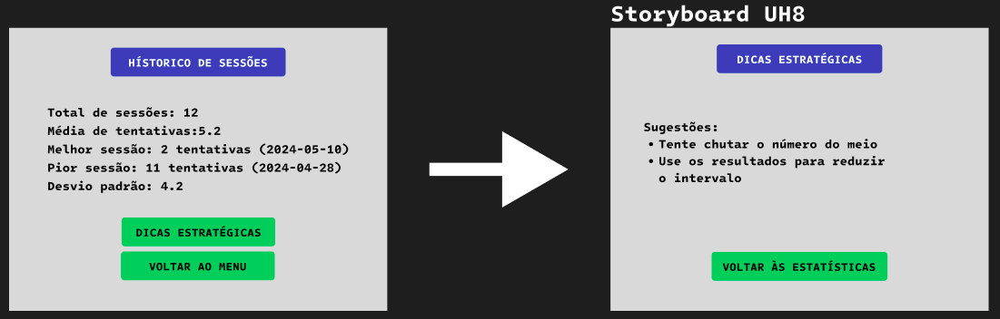 |
| **UH9** | 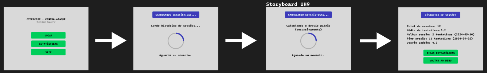 |
| **UH10** | 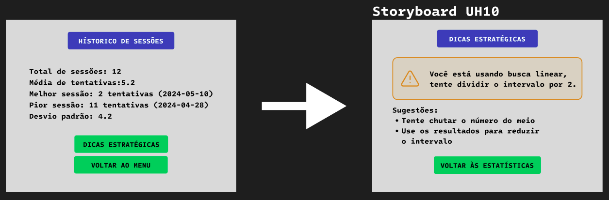 |

- 🔗 [Acesse os sketches e storyboards no Figma aqui](https://www.figma.com/design/rhhIDpgt5qU3j4WoQvU7wj/Sem-t%C3%ADtulo?node-id=0-1&t=rytzOBqNChNGkl37-1)

> *Nota: Todos os arquivos também estão anexados aos seus respectivos cards no Trello.*

### Screencast do Protótipo
Vídeo demonstrativo da navegação e funcionalidades planejadas.
- 📺 [Assista ao Screencast](https://drive.google.com/file/d/1ptDQPoB4hk8FwIXI8O0mnft34nn2L9Tx/view?usp=sharing)

### Diagramas de Atividades do Sistema
Modelagem do fluxo lógico para cada uma das histórias de usuário.

- [X] **UH1:** [Visualizar Diagrama](./assets/diagramas/atividade-uh1.jpg)
- [X] **UH2:** [Visualizar Diagrama](./assets/diagramas/atividade-uh2.jpg)
- [X] **UH3:** [Visualizar Diagrama](./assets/diagramas/atividade-uh3.jpg)
- [X] **UH4:** [Visualizar Diagrama](./assets/diagramas/atividade-uh4.png)
- [X] **UH5:** [Visualizar Diagrama](./assets/diagramas/atividade-uh5.jpg)
- [X] **UH6:** [Visualizar Diagrama](./assets/diagramas/atividade-uh6.jpg)
- [ ] **UH7:** [Visualizar Diagrama](./assets/diagramas/atividade-uh7.png)
- [X] **UH8:** [Visualizar Diagrama](./assets/diagramas/atividade-uh8.jpg)
- [X] **UH9:** [Visualizar Diagrama](./assets/diagramas/atividade-uh9.jpg)
- [X] **UH10:** [Visualizar Diagrama](./assets/diagramas/atividade-uh10.jpg)

> *Nota: Todos os arquivos também estão anexados aos seus respectivos cards no Trello.*

---

## 💻 Entrega 03 – Implementação, Sprint, Testes e Persistência

A Entrega 03 registra o avanço da implementação do jogo, a organização da Sprint 01, o uso do ambiente de versionamento, o acompanhamento de issues/bugs, os testes de sistema e o relato da programação em par utilizada na persistência do histórico.

### Histórias implementadas na Sprint 01

A **Sprint 01** foi composta pelas seguintes histórias de usuário:

- **UH1**
- **UH2**
- **UH3**
- **UH4**
- **UH5**
- **UH6**
- **UH8**
- **UH9**
- **UH10**

> Observação: A UH7 não fez parte do escopo da Sprint 01 desta entrega.

### Implementação de histórias de usuário

Nesta entrega, foram implementadas pelo menos 3 histórias de usuário, conforme solicitado. A tabela abaixo pode ser atualizada com o status final de cada uma:

| História | Funcionalidade | Status |
| --- | --- | --- | --- |
| **UH1** | Iniciar nova partida | [Concluída] |
| **UH2** | Receber dicas “muito alto / muito baixo” | [Concluída] |
| **UH3** | Registrar sessão no histórico | [Concluída] |
| **UH4** | Feedback comparativo com busca binária | [Concluída] |
| **UH5** | Visualizar estatísticas agregadas do histórico | [Concluída] |
| **UH6** | Recuperar histórico ao iniciar o programa | [Concluída] |
| **UH8** | Receber sugestões estratégicas personalizadas | [Concluída] |
| **UH9** | Calcular desvio padrão usando recursão | [Concluída] |
| **UH10** | Identificar monotonicidade dos palpites (recursivo) | [Concluída] |

---

### Criação da Sprint no Board

A **Sprint 01** foi criada no Board do Trello para organizar as histórias, bugs e melhorias da Entrega 03. O quadro foi utilizado para acompanhar o andamento das tarefas da equipe durante a sprint.

**Print da Sprint 01 no Board:**  

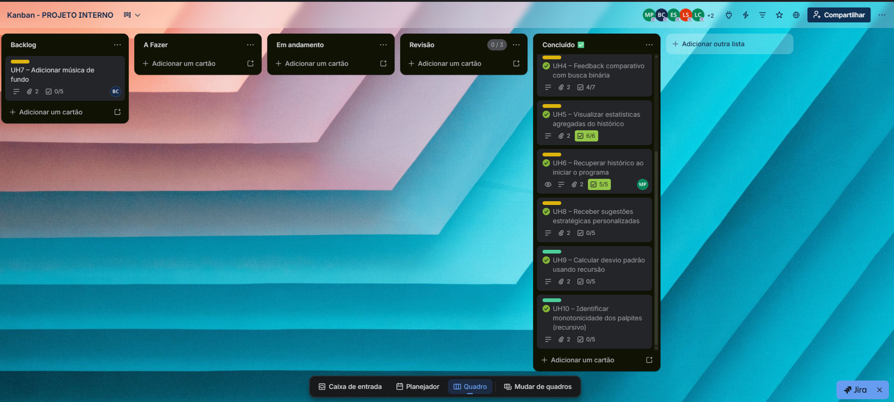

---

### Screencast da Entrega 03

Foi adicionado um novo screencast com ênfase nas novas histórias implementadas na Sprint 01.

**Link do screencast:**  
[Screencast](https://drive.google.com/file/d/1aErr1KYlCdxmnujOfvtayXIt9QxslKtb/view?usp=sharing)


---

### Quadro da Sprint 01 atualizado

O quadro da Sprint 01 foi atualizado para refletir o estado da Entrega 03, incluindo tarefas concluídas, em andamento e pendentes.

**Print do quadro da sprint atualizado:**


---

### Issue/Bug Tracker atualizado

O Issue/Bug Tracker do GitHub foi atualizado com histórias, bugs e melhorias relacionados à Entrega 03.

**Print da tela de Issues:**


| Issue | Tipo | Descrição | Status |
| --- | --- | --- | --- |
| #1 | Melhoria | Confirmar a saída ao pressionar esc | [Aberta] |
| #2 | Melhoria | Mudar o nome do jogo | [Fechada] |

---

### Testes de Sistema

Foram realizados testes de sistema para verificar se as principais funcionalidades do jogo estão funcionando corretamente.

| Caso de teste | O que foi testado | Resultado esperado | Resultado obtido | Status |
| --- | --- | --- | --- | --- |
| **CT01** | Inicialização do jogo | O jogo abre corretamente | O jogo abre corretamente | [OK] |
| **CT02** | Menu principal | O jogador consegue navegar pelas opções | O jogador consegue navegar pelas opções | [OK] |
| **CT03** | Fase do Sudoku | O jogador consegue interagir com o Sudoku | O jogador consegue interagir com o Sudoku | [OK] |
| **CT04** | Fase de lógica proposicional | O jogo valida as respostas | O jogo valida as respostas | [OK] |
| **CT05** | Chute da frequência | O jogo informa alto, baixo ou acerto | O jogo informa alto, baixo ou acerto | [OK] |
| **CT06** | Persistência do histórico | O `historico.txt` é criado e atualizado | O `historico.txt` é criado e atualizado | [OK] |
| **CT07** | Análise do histórico | O jogo exibe estatísticas com base no arquivo | O jogo exibe estatísticas com base no arquivo | [OK] |


---

### Programação em Par experimentada — persistência do histórico

Durante a implementação da persistência do jogo, usamos programação em par para organizar melhor a lógica de salvamento e leitura do histórico. A ideia foi trabalhar com uma pessoa escrevendo o código e outra acompanhando, conferindo se o formato do arquivo estava correto e se os dados seriam carregados depois sem erro. Em alguns momentos os papéis foram trocados, para que os dois pares entendessem como o `historico.txt` funcionava.

A persistência foi feita em arquivo texto simples, porque isso facilita os testes e permite abrir o arquivo manualmente para conferir se as partidas estão sendo salvas corretamente. Cada partida é armazenada em uma linha, usando o formato:

```txt
timestamp;alvo;tentativas;baixos;altos;palpites_csv
```

#### Funcionalidades feitas por cada par

| Par | Funcionalidades executadas |
| --- | --- |
| **Miguel e Lucas Cavalcante — salvamento das partidas** | Implementou a gravação das partidas no `historico.txt`, usando abertura do arquivo em modo de acréscimo. Esse par ficou responsável por salvar o timestamp, o número alvo, a quantidade de tentativas, os palpites baixos, os palpites altos e a lista de palpites em formato CSV. Também verificou se o arquivo era criado corretamente quando ainda não existia. |
| **Miguel e Lucas Cavalcante — leitura, análise e integração do histórico** | Implementou a leitura do histórico com `fgets`, separando os campos por `;` e reconstruindo os dados das partidas antigas. Esse par também integrou o histórico com a tela de análise do jogo, permitindo calcular média de tentativas, melhor sessão, pior sessão, desvio padrão, viés baixo/alto e sugestões de estratégia. |

#### O que aprendemos com essa parte

A programação em par ajudou bastante na parte de persistência, porque qualquer erro pequeno no formato do arquivo poderia atrapalhar a leitura depois. Com duas pessoas revisando o mesmo trecho, ficou mais fácil perceber problemas como separador errado, campo faltando, arquivo não encontrado ou diferença entre salvar uma partida nova e carregar partidas antigas.

Também foi importante manter o histórico em `.txt`, pois isso deixou os testes mais simples. Assim, conseguimos abrir o `historico.txt`, conferir as linhas salvas e confirmar se o jogo estava registrando corretamente as sessões.

---

### Checklist da Entrega 03

- [X] Pelo menos 3 histórias implementadas.
- [X] Sprint criada no Board.
- [X] Board da Sprint 01 atualizado.
- [X] Backlog atualizado.
- [X] Ambiente de versionamento atuante.
- [X] Commits frequentes no GitHub.
- [X] Novo screencast adicionado ao README.
- [X] Issue/Bug Tracker atualizado.
- [X] Testes de sistema documentados.
- [X] Relato de programação em par acessível no README.
- [X] Funcionalidades de cada par descritas.

---

## 🚀 Próximas etapas
- **Entrega 04:** Projeto final polido, testes finais e documentação.

## 📚 Tecnologias
- Linguagem C (padrão C11)
- Biblioteca padrão: `stdio.h`, `stdlib.h`, `time.h`, `math.h`, `raylib.h`
- Persistência em arquivo texto (`historico.txt`)
- Compilação: `gcc -std=c11 -Wall -lm -o jogo main.c`


## 📄 Licença
Projeto acadêmico – sem fins comerciais.

---
*Repositório criado para a disciplina de PIF – Prof. mr-costaalencar*
