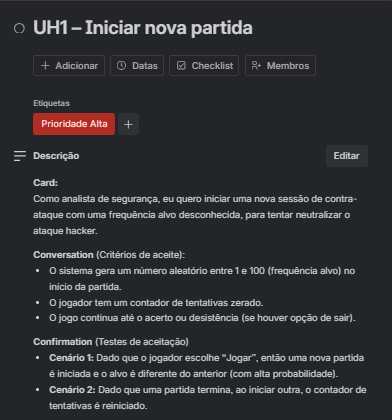
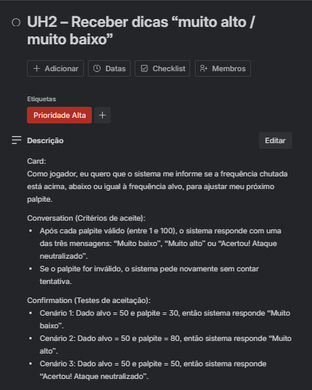
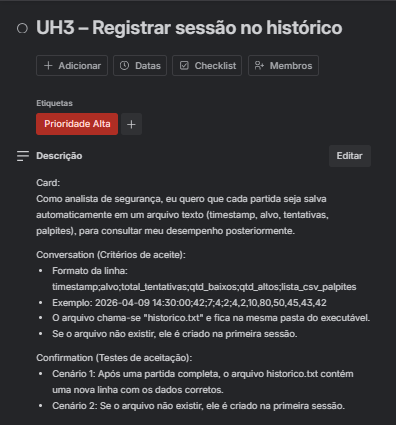
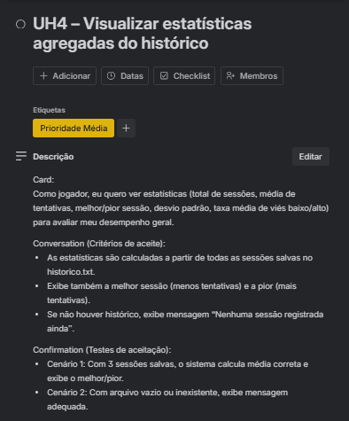
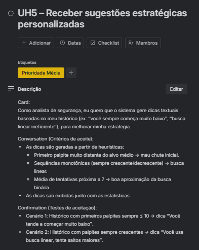
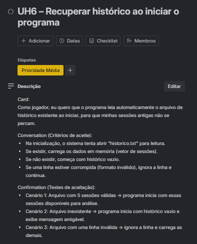
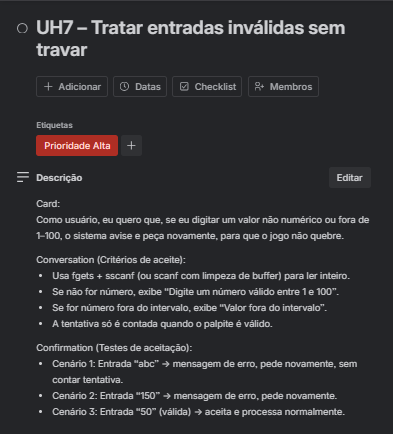
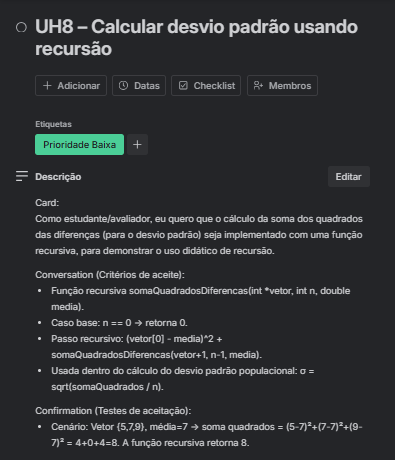
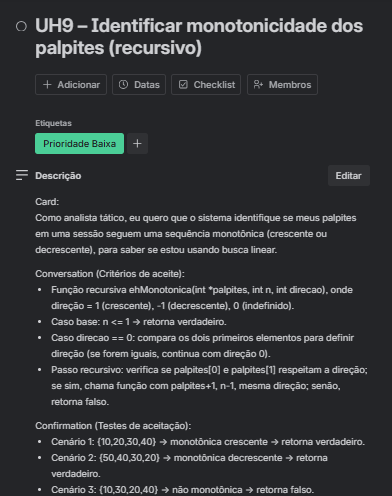
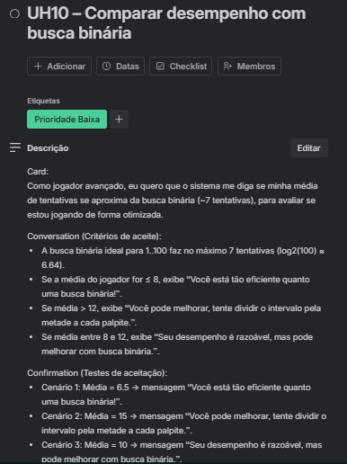

# Histórias de Usuário (Padrão 3Cs)

Abaixo estão os cards do Trello com as 10 histórias de usuário do projeto, cada uma contendo:
- Título e etiqueta de prioridade
- Card (formato "Como... eu quero... para...")
- Conversation (critérios de aceite)
- Confirmation (testes de aceitação)

---

## UH1 – Iniciar nova partida

---

## UH2 – Receber dicas “muito alto / muito baixo”

---

## UH3 – Registrar sessão no histórico

---

## UH4 – Visualizar estatísticas agregadas do histórico

---

## UH5 – Receber sugestões estratégicas personalizadas

---

## UH6 – Recuperar histórico ao iniciar o programa

---

## UH7 – Tratar entradas inválidas sem travar

---

## UH8 – Calcular desvio padrão usando recursão

---

## UH9 – Identificar monotonicidade dos palpites (recursivo)

---

## UH10 – Comparar desempenho com busca binária

